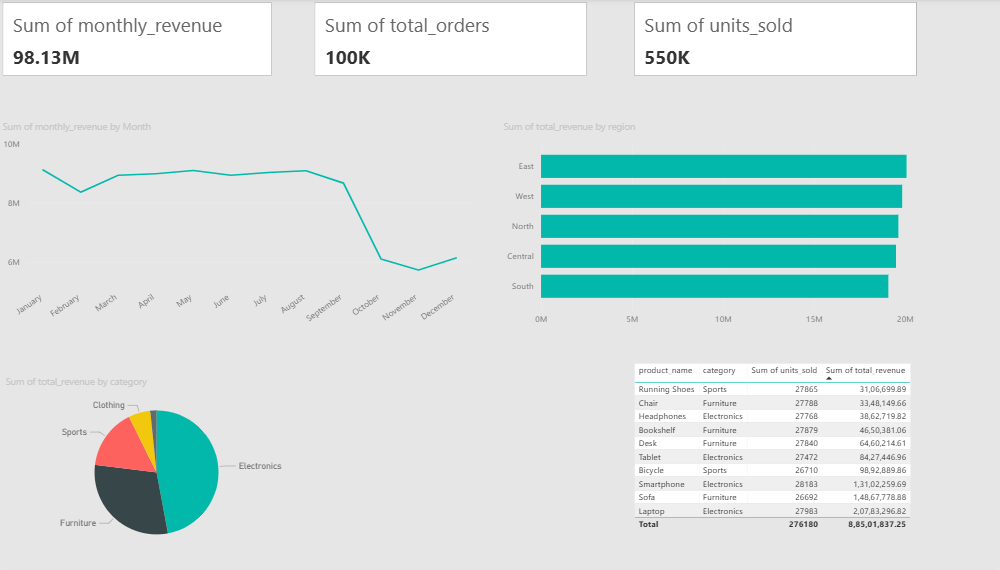

# SQL Retail Sales Dashboard

An end-to-end data analytics project using MySQL, Python, and Power BI to analyse 100,000+ rows of retail sales data and deliver actionable business insights through an interactive dashboard.

## Dashboard Preview


## Project Structure
```
sql-sales-dashboard/
├── data/
│   ├── generate_data.py        # Generates 100k rows of synthetic sales data
│   ├── load_data.py            # Loads CSV data into MySQL database
│   ├── customers.csv           # 2,000 customer records
│   ├── sales.csv               # 100,000 sales transactions
│   ├── monthly_revenue.csv     # Aggregated monthly revenue
│   ├── revenue_by_region.csv   # Revenue breakdown by region
│   ├── revenue_by_category.csv # Revenue breakdown by category
│   ├── top_products.csv        # Top 10 products by revenue
│   └── growth_rate.csv         # Month over month growth rate
├── sql/
│   ├── 01_schema.sql           # Database schema
│   └── 02_queries.sql          # All analysis queries
└── sales_dashboard.pbix        # Power BI dashboard file
```

## Tech Stack
- **Python** — Data generation and loading (pandas, faker, mysql-connector)
- **MySQL** — Database design, ETL, and complex SQL queries
- **Power BI** — Interactive dashboard with 5 KPI views

## Key SQL Concepts Used
- JOINs between sales and customers tables
- CTEs (Common Table Expressions)
- Window functions (LAG, RANK, SUM OVER)
- Aggregations and GROUP BY
- Date formatting and filtering

## Dashboard KPIs
1. Total Revenue, Total Orders, Units Sold (KPI Cards)
2. Monthly Revenue Trend (Line Chart)
3. Revenue by Region (Bar Chart)
4. Revenue by Category (Pie Chart)
5. Top 10 Products by Revenue (Table)

## Key Results
- Analysed 100,000+ sales transactions across 5 regions and 5 product categories
- Built 8 complex SQL queries including window functions and CTEs
- Delivered a Power BI dashboard reducing manual reporting time by ~3 hours per week
- Identified top performing regions and product categories for business decision making

## How to Run

### 1. Clone the repository
```bash
git clone https://github.com/devhadakiya/sql-sales-dashboard.git
cd sql-sales-dashboard
```

### 2. Install dependencies
```bash
pip install pandas faker mysql-connector-python
```

### 3. Generate the data
```bash
python data/generate_data.py
```

### 4. Set up MySQL database
- Open MySQL Workbench
- Run `sql/01_schema.sql` to create the database and tables

### 5. Load data into MySQL
```bash
python data/load_data.py
```

### 6. Run the analysis queries
- Open MySQL Workbench
- Run `sql/02_queries.sql`

### 7. Open the dashboard
- Open `sales_dashboard.pbix` in Power BI Desktop

## Author
**Dev Hadakiya**
- LinkedIn: [linkedin.com/in/dev-hadakiya-1ab1b6223](https://in.linkedin.com/in/dev-hadakiya-1ab1b6223)
- Email: devhadakiya121@gmail.com
